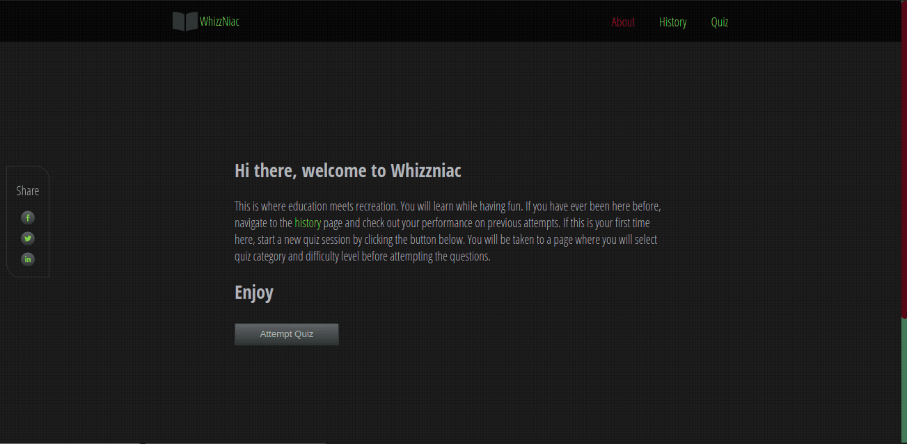

# Wizzniac

## Overview

Whizzniac is a quiz app. It is a Single Page Application with a number of quiz categories for the user to select from. The score in a particular category is persisted in the database.

## Data Source

The quiz used in this application is originally sourced from [Open Trivia Database](https://opentdb.com/) API.

## Dependencies

- [React](https://reactjs.org/)
- [React Router](https://reactrouter.com/)
- [React Firebase Hooks](https://www.npmjs.com/package/react-firebase-hooks)
- [React Hamburger Menu](https://www.npmjs.com/package/react-hamburger-menu)
- [uuid](https://www.npmjs.com/package/uuid)
- [Axios](https://www.npmjs.com/package/axios)

## License

[MIT](https://choosealicense.com/licenses/mit/)

## Running the project locally

To run the project locally, you need to go through the following steps:

1. Clone the project to your local machine using the command `git clone https://github.com/nibble0101/whizzniac.git`. It requires you to have [git](https://git-scm.com/downloads) and [node](https://nodejs.org/en/) installed
2. Create `.env` file at the root of the project directory
3. Copy and paste the content of `example.env` file in the `.env` file you created
4. Create a [firebase project](https://firebase.google.com/). The values of the environment variables in the `.env` file should be the same as the corresponding value of the keys to your firebase project.
5. Run the command `npm install` to install dependencies
6. Run the command `npm run start` to start the development server on `localhost`. Navigate to `http://localhost:3000/` to view the app running on your machine

## Live Project

This project is hosted live on [Netlify](https://whizzniac.netlify.app/).

